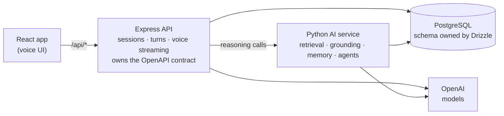

# Adalat AI

**A voice-first moot-court simulator for Pakistani law students.** Students pick
or generate a case, argue through each courtroom phase, examine witnesses, and
receive a scored, grounded AI verdict with actionable feedback — while an
adversarial bench of AI agents pushes back in real time.

The system is built to be *trustworthy about the law*: every statutory citation
shown to a student is checked against a corpus, and text that has not been
authenticated against the official source is labelled rather than presented as
settled law.

---

## What makes it more than a chatbot

| Capability | How |
| --- | --- |
| **Hybrid legal retrieval** | BM25 (lexical) + dense vectors fused with Reciprocal Rank Fusion (k=60), then reranked by an LLM scoring *legal applicability* — a general-purpose cross-encoder measurably hurt recall on legal phrasing, so it is off by default. |
| **Multi-agent courtroom** | A LangGraph `StateGraph` of independent agents — judge, opposing counsel, witness — with a supervisor that routes one utterance through however many agents the moment needs. |
| **Autonomous objections** | Opposing counsel decides *on its own* whether a question is improper and objects on a specific evidentiary ground, only ever citing a provision that exists. |
| **Judge as a ReAct agent** | Before ruling on an objection the judge calls a `search_statute` tool to read the governing provision and its neighbours; the Thought→Action→Observation trace is returned. |
| **Two-tier agent memory** | Verbatim working memory of the current phase plus an incrementally-summarised long-term case file, so opposing counsel can catch a student who changes their story across phases. |
| **Trustworthy citations** | Every citation an agent or student makes is audited against the corpus; fabricated provisions are flagged, and the verdict's legal-reasoning score treats the audit as ground truth. |
| **Measured, not vibes** | An evaluation harness scores retrieval (recall@k, MRR) and the AI judge (consistency + discrimination) against golden sets — reranked retrieval hits MRR 1.00, and the judge ranks strong/mixed/weak advocacy correctly with citation accuracy 100% vs 0%. |

The design and measured results are documented per subsystem:
[`docs/agents.md`](artifacts/ai-service/docs/agents.md) (multi-agent),
[`docs/retrieval.md`](artifacts/ai-service/docs/retrieval.md) (RAG), and
[`docs/evaluation.md`](artifacts/ai-service/docs/evaluation.md) (eval harness).

---

## Architecture

Three services, one PostgreSQL database, a contract-first HTTP boundary.



- The **browser never talks to the AI service directly** — all reasoning is
  reached through the Express API using same-origin `/api/*` URLs.
- **Reasoning lives in Python.** The Express API owns the HTTP contract, session
  persistence and voice streaming, and calls the Python service for anything
  that needs a model.
- **Drizzle (`lib/db`) is the single source of schema truth.** The Python
  service reads and writes the same database with raw SQL but never defines or
  migrates tables, so a schema change surfaces as a loud query error rather than
  silent drift.
- **The OpenAPI document owns transport types.** `lib/api-spec/openapi.yaml` is
  the source of truth; the React Query client and the server-side Zod validators
  are generated from it — never hand-edited.

---

## Repository layout

```
artifacts/
  adalat-ai/        React 19 + Vite web app (voice UI, dashboard)
  api-server/       Express 5 API: sessions, turns, voice streaming, dashboard
  ai-service/       Python FastAPI service: retrieval, grounding, memory, agents
  mockup-sandbox/   UI mockup scratch space
data/
  statutes/         Pakistani statute corpus (source of truth for citations)
lib/
  api-spec/         openapi.yaml — the HTTP contract — + Orval codegen config
  api-client-react/ generated browser client + shared fetch
  api-zod/          generated server-side request/response validators
  db/               Drizzle schema (cases, sessions, turns, verdicts, statutes)
  integrations-openai-ai-server/  server OpenAI client + audio utilities
  integrations-openai-ai-react/   mic recording + streamed audio playback hooks
scripts/            db setup, seeding, statute ingestion
```

---

## Getting started

### Prerequisites

- **Node.js 24** and **pnpm**
- **Python 3.12+** (for the AI service)
- **PostgreSQL** with the `pg_trgm` extension (pgvector is *not* required — see
  below)
- An **OpenAI API key**

### 1. Install

```bash
pnpm install
pip install -e artifacts/ai-service        # or: pip install -e "artifacts/ai-service[dev]"
```

### 2. Configure

Copy the example env file and fill it in (all services read this one file):

```bash
cp .env.example .env
```

| Variable | Purpose |
| --- | --- |
| `DATABASE_URL` | PostgreSQL connection string. |
| `OPENAI_API_KEY` | Case generation, transcription, voice replies, verdict scoring. |
| `AUTH_SECRET` | Signs the session cookie. 32+ characters, no default — sign-in fails loudly without it. |
| `AI_SERVICE_URL` | Base URL of the Python service (default `http://localhost:8000`). |
| `PORT` | API service port (default `5000`). |
| `API_PORT` | API port used by the Vite dev proxy (default `5000`). |
| `BASE_PATH` | Web app base path (default `/`). |
| `RERANKER_BACKEND` | `llm` (default), `cross_encoder`, or `none`. |
| `MODEL_TEXT` | Text model for case/verdict generation and reranking (default `gpt-4o`). |
| `MODEL_TTS` | Speech synthesis for spoken agent replies (default `gpt-4o-mini-tts`). |
| `MODEL_EMBEDDING` | Embedding model for the statute index (default `text-embedding-3-small`). |

### 3. Set up the database and corpus

```bash
pnpm --filter @workspace/db run push     # apply the Drizzle schema
pnpm run db:seed                          # seed practice cases (optional)
pnpm run statutes:ingest                  # ingest + embed the statute corpus
```

### 4. Run

```bash
pnpm run dev:ai      # Python AI service on :8000
pnpm run dev:api     # Express API on :5000
pnpm run dev         # web app on :5173
```

---

## Command reference

| Command | Description |
| --- | --- |
| `pnpm run dev` / `dev:api` / `dev:ai` | Run the web app / API / AI service. |
| `pnpm run typecheck` | Type-check all libraries, apps, and scripts. |
| `pnpm run build` | Type-check and build production bundles. |
| `pnpm --filter @workspace/api-spec run codegen` | Regenerate the client + Zod validators from `openapi.yaml`. |
| `pnpm --filter @workspace/db run push` | Apply the Drizzle schema to the database. |
| `pnpm run statutes:ingest` / `statutes:reindex` | Ingest / force re-embed the statute corpus. |
| `pnpm run simulate-courtroom <sessionId> "<utterance>"` | Drive one turn through the multi-agent graph and print the agent trace (read-only). |
| `pnpm run simulate-turn <sessionId> "<utterance>"` | Single-persona text turn (evaluation baseline). |
| `pnpm run eval` | Run the evaluation suite (retrieval recall@k/MRR + judge reliability/discrimination). |

Try the multi-agent system (both `dev:ai` and a seeded session required):

```bash
pnpm run simulate-courtroom 5 --phase witness_examination \
  --witness "Sana Arif" "You saw him do it with your own eyes, didn't you?"
```

---

## A session, end to end

A session advances in a strict order: **opening → witness examination →
cross-examination → closing → verdict.**

1. Browse cases by area and difficulty, or generate a new Pakistani-law
   scenario (grounded in retrieved provisions).
2. Choose the petitioner or respondent side.
3. Argue each phase by voice: your speech is transcribed and run through the
   multi-agent graph, and each agent that acts streams back over server-sent
   events in its own voice.
4. Call witnesses; opposing counsel may object autonomously and the bench rules
   — out loud, mid-turn. A sustained objection ends the question before the
   witness ever answers it.
5. Submit for a verdict — a scorecard (legal reasoning, persuasiveness,
   procedure, factual command), a citation-accuracy figure computed from the
   corpus, and written feedback.

---

## Design notes & gotchas

- **No pgvector required.** The host PostgreSQL only has `pg_trgm`, so embeddings
  are stored as `jsonb` and searched with an exact cosine scan. At this corpus
  size that is faster than an approximate index and gives exact recall.
- **LangGraph import is slow (~cold start).** The compiled agent graph is built
  lazily and cached, so it is paid once on the first turn rather than at every
  service start.
- **Codegen is authoritative.** Generated files under `lib/api-*/src/generated`
  change wholesale after `codegen`; review the `openapi.yaml` diff, not the
  generated output.
- **Keep OpenAI credentials out of the web app** — they are consumed only by the
  API and AI services.
- **The statute corpus is verified — 52 of 53 provisions.** Every provision was
  originally written from model knowledge, and each has since been diffed
  word-for-word against an official source with `pnpm run statutes:verify`, with
  the wording replaced from the source wherever the two disagreed.

  **Qanun-e-Shahadat Order 1984 20/20, Pakistan Penal Code 15/15, Code of
  Criminal Procedure 10/10** against the
  [pakistancode.gov.pk](https://pakistancode.gov.pk) prints, and **Constitution
  1973 7/8** against the National Assembly print of 28 February 2012.

  **The exception is Constitution Art. 199**, and it is instructive: the corpus
  text is *later* than that print — it refers to the Federal Constitutional
  Court and to clause (1A) barring suo motu action — so the 2012 source cannot
  confirm it. It carries a per-provision `"verified": false` with a note saying
  why, and everything retrieved from it is labelled ⚠ in the interface. That is
  the article every writ petition is filed under, so the gap is disclosed rather
  than rounded away. Verification is **per provision**, not per statute: a
  file-level flag would either have marked Art. 199 verified because its
  neighbours were, or hidden seven diffed articles behind the one that is not.

  The repair also found that three Constitution articles were not merely
  unchecked but **corrupted**: Art. 4 had a paragraph of 1985 commencement
  footnotes spliced inside clause (2), and Arts. 8 and 10 were truncated
  mid-article — Art. 8 was missing the armed-forces exception, and Art. 10 the
  entire preventive-detention regime a habeas petition turns on. A further 38
  printed footnote anchors ("1Provided", "3Federal Constitutional Court") were
  stripped across the corpus, without touching the law's own numbering.

  The exercise found six numbering errors, not just wrong wording: an objection
  ground cited QSO Art. 143 for a rule that lives in Art. 148, the whole
  documentary-evidence block was shifted by one, and PPC s.375 carried the
  definition of rape repealed in 2016. **The citation audit could not have
  caught any of them** — it checks that a cited provision exists in the corpus,
  and the corpus was its own ground truth.

---

## Status

Built and working: contract-first API, hybrid RAG with citation verification,
grounded case/objection/verdict generation, two-tier agent memory, the
multi-agent courtroom (LangGraph agents with tool use and autonomous
objections), an evaluation harness covering retrieval, the AI judge and the
courtroom agents (32 labelled objection scenarios: objection F1 1.00,
specificity 1.00, ground accuracy 100%), and the voice session — spoken turns run through the same graph as text turns, and each agent
answers in its own synthesized voice.

The voice path has been driven end to end with synthesized student audio: one
spoken question produced an autonomous objection and a sustained ruling, with
opposing counsel taking the floor at 6.9s and **first audio at 8.1s** (down from
16.1s — agent events stream out of the graph as each node completes, so the
objection is spoken while the bench is still reading statute). Citation audit
1/1 verified, and every citation is audited *before* its line is spoken.
**Microphone capture and browser playback are still untested**; that needs a
real device.

Generated cases are drafted as **filings, not summaries**: a case now carries a
brief with numbered facts, lettered grounds and an itemised prayer, and the
courtroom agents read it — the bench presses the student on grounds they actually
pleaded. Every ground's citations are audited against the corpus before the case
is stored, and a ground resting on a provision that does not exist is dropped
rather than taught. Generation itself moved out of the Express route and behind
the AI service, so the only prompt left on the Node side is the manually-raised
objection ruling.

The web app presents a session as a **record of proceedings** rather than a chat
log: numbered paragraphs, a ruled speaker column, and a provenance rail carrying
every provision an agent relied on beside the words it produced. The rail reads
the corpus's own `verified` flag per provision, so 52 of 53 now read ✓ verified
while Constitution Art. 199 — the one provision whose source is out of date —
reads ⚠, and a citation the corpus does not recognise is marked too, rather than
passing silently.

Note that a case stores its `citations` as a snapshot taken when it was
generated, so cases drafted before the corpus was verified still show ⚠ against
provisions that now read ✓. The live audit and the session provenance rail read
the corpus directly and are correct; regenerate a case to refresh its snapshot.

**Sessions are scoped to the student who argued them.** Registration and sign-in
are email + password, hashed with scrypt from Node's standard library and
carried in an httpOnly, sameSite cookie signed with `AUTH_SECRET`. Every
`/sessions/*` route reaches its session through a single loader that filters on
the owner, so a session belonging to someone else is a 404 rather than a 403 —
the response does not confirm it exists. The dashboard, which previously
averaged every mark in the database and presented the result as the reader's own
progress, is scoped by the same query. The case library stays shared: it is
teaching material, not anyone's record.

Sign-in is rate limited on two keys at once — 8 failures per account and 30 per
address in 15 minutes, checked before the password is verified so a blocked
caller cannot spend the server's hashing time either. Both are needed: limiting
by account alone lets one guess be sprayed across a roster, and limiting by
address alone would let a lab behind one NAT lock its own students out. A
successful sign-in forgives the account's counter but not the address's.
Per-address limiting only distinguishes callers when Express can see the real
client address, which behind a proxy means setting `TRUST_PROXY`.

Planned: an LLMOps layer (cost/latency tracking, tracing, CI, Docker) and the
remaining security hardening (prompt-injection guards on transcribed speech).
