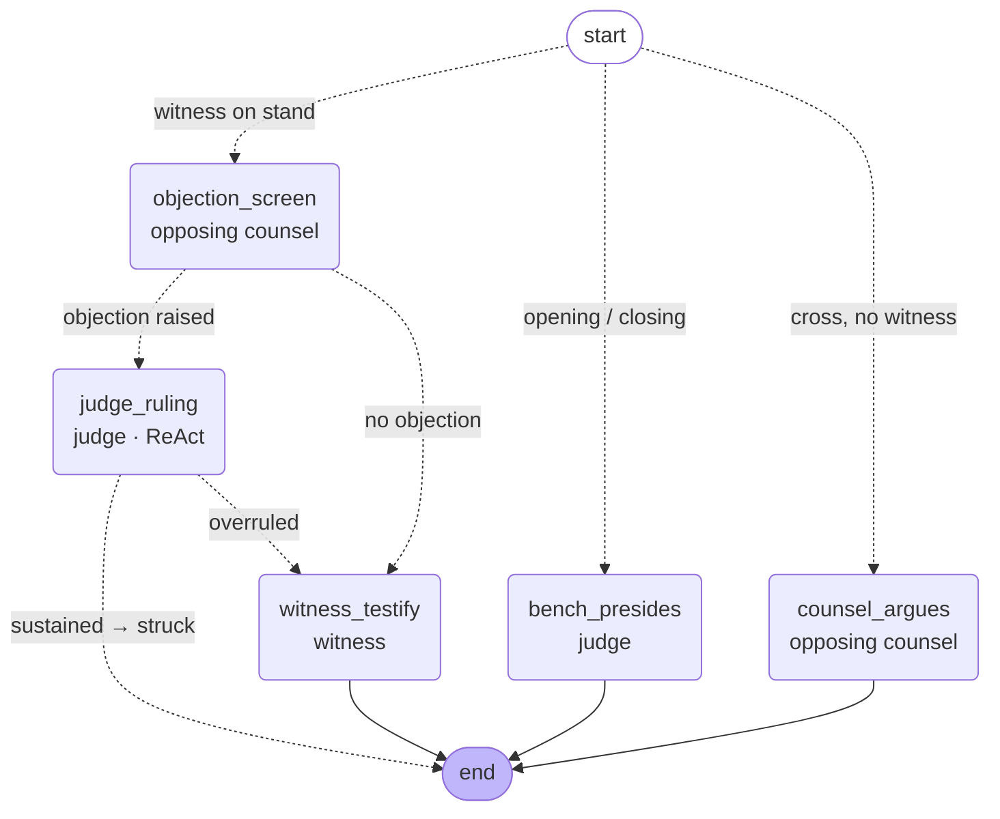

# The multi-agent courtroom

The courtroom is a **LangGraph `StateGraph`**. Each participant — the judge,
opposing counsel, a witness — is an independent agent (its own system prompt,
its own decision to make, its own tools). The supervisor is the set of
conditional edges that route one student utterance through however many agents
the moment requires.

This replaced a single completion that swapped personas by phase. That design
could never produce the thing a moot court actually needs: **opposing counsel
objecting on its own, the judge reading the statute and ruling, and only then
the witness answering** — three agents acting in sequence on one question. Here
that is just a path through the graph.

## The graph



The live diagram (kept in sync with the compiled graph) is served at
`GET /courtroom/graph`.

### Nodes (agents)

| Node | Agent | Role |
| --- | --- | --- |
| `objection_screen` | opposing counsel | After every question to a witness, decides **autonomously** whether to object, and on which evidentiary ground. |
| `judge_ruling` | judge | A **ReAct** loop: reads the governing provisions with the `search_statute` tool, then rules sustained/overruled. |
| `witness_testify` | witness | Answers in character, consistent with its statement and prior testimony. |
| `counsel_argues` | opposing counsel | Rebuts the student during a cross with no witness up. |
| `bench_presides` | judge | Moderates openings and closings. |

### Edges (the supervisor)

Routing is pure functions over the shared context, not another model call — the
phase and the presence of a witness fully determine who may act:

- **Entry** — a witness on the stand routes to `objection_screen`; otherwise
  straight to the primary responder (`bench_presides`, or `counsel_argues` in a
  cross with no witness).
- **After the objection screen** — an objection routes to `judge_ruling`;
  silence routes to the primary responder.
- **After a ruling** — *sustained* strikes the question and ends the turn (the
  witness never answers); *overruled* lets the witness answer.

## Why the judge is a ReAct agent

An evidentiary objection is decided by what the law actually says, not by how it
sounds. So the judge does not rule from memory — it runs a bounded
Thought→Action→Observation loop, calling `search_statute` to pull the provision
the objection rests on **together with its neighbours** (a leading-question
objection under QSO Art. 137 is read alongside Art. 136, which defines a leading
question, and Art. 138, which says when one is allowed). Every step of that loop
is recorded and returned, so the ruling is not merely grounded — it is *shown*
to be grounded.

The loop is capped at three tool rounds and degrades safely: if the model never
produces a ruling it is forced to, and a total failure overrules (the least
disruptive default, since overruling lets a possibly-proper question stand
rather than wrongly striking it).

### The thought is a tool argument, not narration

`search_statute` requires a `thought` parameter — one sentence on what the bench
needs to check and why — alongside the query. That is not decoration. The
thought was originally read off the assistant message, but under
`tool_choice="auto"` a model that decides to call a tool returns
`content=None`, so every recorded step carried an empty thought and the trace
shown to a student was two-thirds of a ReAct loop. Prompting for narration is
unreliable; a required argument cannot come back empty, and it binds the
reasoning to the specific call it justifies.

Measured cost of that visibility, over the same 32 scenarios: objected turns
$0.0153 → $0.0168 (+10%), silent turns unchanged at $0.0020, and objection
precision/recall/F1/specificity all still 1.00 with ruling accuracy 100%. See
[`docs/evaluation.md`](evaluation.md).

## Why opposing counsel is the autonomous actor

Its defining behaviour is the objection nobody asked for. After each question
the student puts to a witness, opposing counsel decides on its own whether the
question is improper. It may only object on a ground whose backing provision
exists in the corpus (the catalogue is resolved from the statute book in
[`grounding.py`](../app/grounding.py)), so **every objection it raises is citable
by construction**. It is instructed to stay silent unless a ground clearly
applies — an advocate who objects to everything is noise, not opposition.

## What the agents know about the case

Every agent prompt embeds `AgentContext.case_context()`
([`state.py`](../app/agents/state.py)). It always carries the title, area,
summary, applicable laws, which side the student is on, and the phase.

When the case has a **brief** — a pleading with numbered facts, lettered grounds
and an itemised prayer — three further blocks are appended:

```
Facts as pleaded:      1. …  2. …
Grounds raised:        A. …  B. …
Relief sought:         (a) … (b) …
```

The grounds are the point. They are the propositions the case stands on, so the
bench and opposing counsel are told them outright instead of having to infer an
argument from the summary — a student can now be pressed on a ground they
actually pleaded.

Two properties this design depends on:

- **An absent brief renders byte-identical to the version that predated it.**
  Library cases and everything generated before the brief existed carry
  `brief = null`, and the courtroom must not behave differently for them.
- **The lists are capped** (8 facts, 6 grounds, 5 prayer items, 400 characters
  each, in [`casegen.py`](../app/casegen.py)). This block rides in every agent
  call — the objection screen, the ruling, the testimony, the bench — so an
  unbounded facts list would multiply the per-turn cost four ways.

## Grounding and trust

Everything the agents say in a turn is run through the same citation audit used
elsewhere: any provision cited that is absent from the corpus is flagged, not
passed to the student as law. Grounding is not a guarantee, so it is checked.

The same audit runs over a generated case *before* it is stored, and it now
covers each ground's text as well as the `applicableLaws` string. A ground is
prose that contains citations, so an invented section number inside one would
otherwise reach a student as pleaded law with nothing checking it. Any ground
citing a provision that does not exist is dropped, and a case with fewer than
two grounds left standing is rejected rather than persisted thin.

## Verified traces

**Leading question in examination-in-chief** (student leads their own witness):

```
STUDENT: "Ms. Arif, you saw the accused stab the victim with your own eyes,
          didn't you?"

  [1] OPPOSING COUNSEL  (objection · leading_question · QSO 1984 Art. 137)
      "Objection, My Lord, the question is leading."

  [2] JUDGE  (ruling · sustained)
      ReAct: search_statute("leading question examination-in-chief")
             → QSO Art. 137; 136; 133; 138
      "[SUSTAINED] Under QSO 1984 Art. 137, leading questions must not be asked
       in examination-in-chief if objected to ... The question is leading as
       defined in Art. 136 ... rephrase to avoid suggesting the answer."

  citation audit: 1/1 verified (100%), 0 fabricated
  → objection sustained, so the witness did not answer.
```

**Foundationless accusation put to a witness in cross:**

```
STUDENT: "Mr. Nabi, the ownership entry was forged by the Authority to grab my
          client's plot, was it not?"

  [1] OPPOSING COUNSEL  (objection · insulting_question · QSO 1984 Art. 143)
  [2] JUDGE  (ruling · sustained)
      ReAct: search_statute("Question intended to insult or annoy")
             → QSO Art. 143; 146; 151; 161
```

Opposing counsel chose a *different, well-founded* ground for a different kind of
improper question — evidence the objection is reasoned, not scripted.

> **The article numbers in this trace are stale, and deliberately left as
> recorded.** The corpus filed *"Questions intended to insult or annoy"* under
> Art. 143 and *"Questions lawful in cross-examination"* under Art. 146. Diffing
> against the official text (`pnpm run statutes:verify qso-1984`) showed those
> are Arts. **148** and **141**; Art. 143 is *"Court to decide when question
> shall be asked"*. The corpus and `grounding.py` are corrected, so a fresh run
> cites Art. 148 — but this transcript is what the system actually printed on
> the day, so it is annotated rather than rewritten.
>
> Worth stating plainly: **the citation audit could not catch this.** It checks
> that a cited provision exists *in the corpus*, and the corpus was its own
> ground truth. An internally consistent corpus that is wrong against the
> statute book passes every guard in this repo. That is the failure mode
> corpus verification exists to close.

**Fair question, leading permitted (cross-examination):**

```
STUDENT: "Constable, at what time did you reach the scene, and how far was the
          knife from the victim?"

  [1] WITNESS  (testimony)
      "I arrived at around 9pm. The knife was about two metres from the victim."

  → no objection; the supervisor routed straight to the witness.
```

## Running it

The reasoning service must be running (`pnpm run dev:ai`). Then:

```bash
# read-only simulator — drives a real session and prints the agent trace
pnpm run simulate-courtroom <sessionId> --phase witness_examination \
  --witness "Sana Arif" "You saw him do it, didn't you?"
```

Or through the API (persists the turns):

```bash
curl -X POST http://localhost:5000/api/sessions/<id>/turn \
  -H 'Content-Type: application/json' \
  -d '{"utterance":"You saw him do it, didn'"'"'t you?"}'
```

## Speaking the turn

The voice endpoint (`POST /sessions/:id/voice-turns`) runs the same graph. The
student's audio is transcribed, the transcript enters at START exactly as a text
turn does, and the ordered events come back the same way — the reasoning path is
shared, not mirrored.

What the voice endpoint adds is delivery. For each event in turn it announces
the speaker, streams the words, then streams that agent's synthesized voice
(one voice per agent, so an objection cutting across a witness answer is
audibly a different person). A sustained objection therefore ends the turn
mid-question out loud: counsel objects, the bench rules, and the witness never
speaks.

### The turn streams out of the graph

`POST /courtroom/turn/stream` yields each agent event as its node completes
(NDJSON), and the voice endpoint persists and speaks each one on arrival. That
is not a cosmetic difference. With the batch endpoint the caller cannot speak
counsel's objection until the judge has *also* finished its ReAct loop, which
measured **16.1 s of silence** before the first sound. Streaming lets the
objection be heard while the bench is still reading statute — **8.1 s**, and
counsel now takes the floor at 6.9 s while the ruling only lands at 13.8 s.

`run_turn` (batch, still used by the text turn) is defined *in terms of*
`run_turn_stream` rather than beside it, so the text courtroom and the voice
courtroom cannot drift into two different courtrooms. The turn-level citation
audit is still taken over the joined transcript, so a provision two agents both
cite is counted once and the batch caller's numbers are unchanged.

Each streamed event also carries **its own audit**, computed before the words
are spoken. Auditing is a regex pass over an in-memory index — no model call —
so a fabricated provision can be flagged on the utterance that carried it,
while that utterance is still the thing the student is hearing, rather than at
the end of the turn.

Synthesis is the dedicated TTS endpoint, not an audio chat model. A completion
asked to "repeat this text" may paraphrase, and a paraphrased citation would no
longer be the one the audit verified — so the spoken words are the audited
words, or synthesis fails and the turn falls back to text. Audio cannot carry
the written record's ⚠ badge either, so each `speaker` event ships the
provenance (`grounded`, with each provision's `verified` flag) alongside the
words, and the live caption shows the unverified warning while the line is
being spoken.

### Measured, on a real request

Driving the endpoint with synthesized student audio (case 4,
`witness_examination`, Ghulam Nabi on the stand), with the question *"Mr. Nabi,
you saw the Authority forge the ownership entry with your own eyes, didn't
you?"* — the same request before and after the streaming change:

| | batch | streamed |
| --- | --- | --- |
| **First audio byte** | 16.1 s | **8.1 s** |
| Counsel takes the floor | 16.1 s | **6.9 s** |
| Bench rules | 16.1 s | 13.8 s |
| Total turn | 22.5 s | 20.5 s |
| Audio streamed | 292 chunks, 1.63 MB | 305 chunks, 1.82 MB ≈ 38 s of PCM16 @ 24 kHz |
| Misaligned chunks | 0 | 0 — every chunk an even byte length, so the worklet's `Int16Array` decode never throws |
| Citation audit | 1/1 verified, 0 fabricated | 1/1 verified, 0 fabricated |

Both runs produced two agents and no witness answer: the sustained objection
struck the question, as designed. (The ground differed between runs —
`insulting_question` under Art. 143, then `leading_question` under Art. 137 —
both well founded for that question, and evidence the objection is reasoned
rather than scripted. Art. 143 is the stale number recorded on the day; the
provision is Art. 148 — see the note above.)

What remains in front of the first sound is **4.5 s of transcription**, now the
largest single component. A faster transcription model is the next lever.

### Transcription is given the case's proper nouns

Whisper has no prior for Pakistani names and rendered "Mr. Nabi" as **"Mr.
Nobby"**, which then reached the agents as the name of a witness who does not
exist. The parties and witnesses from the case file are passed as the
transcriber's vocabulary hint, which fixed that spelling. It biases spelling
only — it cannot add words the speaker did not say — and the names come from the
case record, never from anything the student said.

**Still not verified:** microphone capture and worklet playback in a browser.
The request above supplied synthesized audio directly, so everything from
transcription through synthesis is exercised, but no one has heard it. That test
is the user's.
